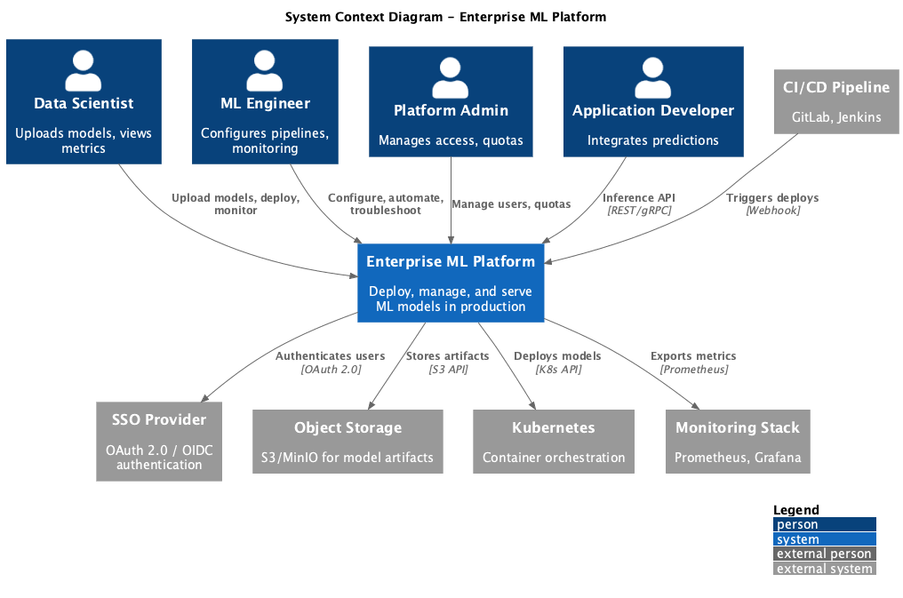
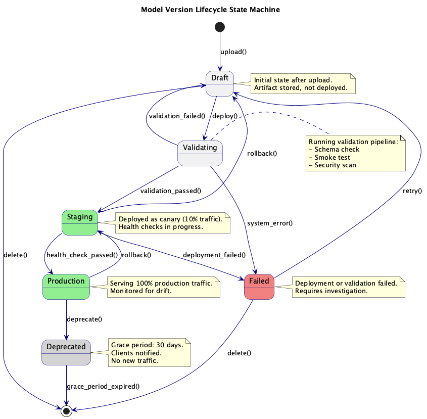
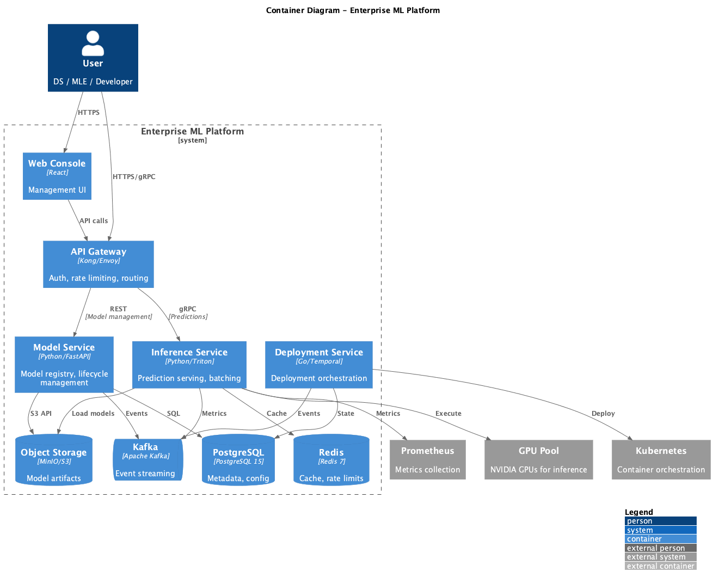

= Enterprise ML Platform: Концептуальная архитектура
:toc: left
:toclevels: 3
:icons: font

== 1. Диаграмма концептуальной архитектуры

_Исходник: link:diagrams/sources/c4-context.puml[c4-context.puml]_

== 2. Описание архитектуры

=== 2.1 Выбранный архитектурный стиль

**Микросервисная архитектура** с **событийно-ориентированной коммуникацией**

==== Обоснование

[cols="1,2,2"]
|===
| Критерий | Выбор микросервисов | Компромисс

| Независимое развёртывание
| Model Service, Inference Service и Deployment Service могут развёртываться независимо
| Повышенная операционная сложность

| Технологическая гетерогенность
| Inference может использовать Python/Triton, а управление — Go/FastAPI
| Несколько технологических стеков для поддержки

| Масштабируемость
| Inference Service масштабируется независимо от Model Service
| Сетевые накладные расходы между сервисами

| Изоляция отказов
| Сбой в Deployment Service не влияет на работающий инференс
| Сложность распределённой системы

| Автономность команд
| Команда платформы и ML-команда могут работать независимо
| Необходимость чётких API-контрактов
|===

==== Почему не альтернативы

* **Монолит**: Ограничил бы независимое масштабирование инференса vs управления
* **Serverless**: GPU-нагрузки не подходят для serverless с чувствительностью к холодному старту
* **Чистый Event-Driven**: Синхронный инференс требует request-response, а не чисто событийного потока

=== 2.2 Применённые паттерны

[cols="2,3,3"]
|===
| Паттерн | Применение | Обоснование

| API Gateway
| Единая точка входа для всех клиентских запросов
| Аутентификация, rate limiting, маршрутизация в одном месте

| Конечный автомат
| Жизненный цикл модели: Draft → Validating → Staging → Production → Deprecated
| Явные переходы состояний, аудит, предотвращение невалидных операций

| Circuit Breaker
| Inference Service к GPU Workers
| Предотвращение каскадных отказов при нездоровом GPU-пуле

| Sidecar
| Сбор метрик, логирование для всех сервисов
| Единообразная observability без изменений кода

| Registry Pattern
| Model Registry как центральное хранилище артефактов
| Единый источник истины для версий моделей

| Canary Deployment
| Постепенный сдвиг трафика на новую версию модели
| Безопасные обновления production с автоматическим откатом

| Blue-Green Deployment
| Zero-downtime развёртывание новых версий
| Мгновенный откат при проблемах

| CQRS (частичный)
| Раздельные пути чтения/записи для инференса vs управления
| Оптимизация пути инференса для низкой латентности

| Saga (Orchestration)
| Транзакционный контроль квот в биллинге, workflow развёртывания через Temporal
| Компенсация при сбоях многошаговых операций

| Горизонтальное масштабирование
| Inference Service, GPU Workers, API Gateway
| Линейный рост пропускной способности под нагрузкой

| Шардирование
| Данные тенантов, метрики по моделям
| Изоляция и распределение нагрузки

| Репликация
| Артефакты моделей (минимум 3 реплики), кросс-региональная синхронизация
| Надёжность и доступность данных

| Кэширование
| Redis для предсказаний, кэш артефактов
| Снижение латентности и нагрузки на backend

| Очереди / Асинхронность
| Kafka для событий, async inference, batch-задачи
| Развязка компонентов, обработка пиков нагрузки

| Балансировка нагрузки
| Глобальный LB, внутрикластерный LB
| Распределение трафика, высокая доступность

| Rate Limiting
| API Gateway по тенантам и API-ключам
| Защита от перегрузки, справедливое распределение ресурсов

| Event-driven
| События изменения состояний, алертинг
| Слабая связанность, реактивность системы

| Streaming / WebSocket
| SSE/WebSocket для LLM token streaming
| Real-time доставка результатов

| Time-series
| Хранение метрик inference и дрифта
| Анализ трендов, детекция аномалий

| Мультитенантность
| Изоляция данных, квоты, RBAC по тенантам
| Безопасная работа нескольких команд на общей платформе

| Гео-маршрутизация
| Направление запросов к ближайшему региону
| Минимизация латентности для глобальных пользователей

| Аудит / Event Sourcing
| Лог всех изменений состояний и действий
| Комплаенс, отладка, восстановление истории

| RBAC
| Ролевой доступ на уровне платформы и тенантов
| Гранулярный контроль прав

| Retry / DLQ
| Повторы с exponential backoff, dead letter queue для batch
| Устойчивость к transient failures
|===

=== 2.3 Ключевые компоненты

[cols="2,3,2"]
|===
| Компонент | Ответственность | Технология

| API Gateway
| Аутентификация, rate limiting, маршрутизация, TLS termination
| Kong / Envoy

| Model Service
| CRUD моделей, реестр, управление версиями
| Python / FastAPI

| Inference Service
| Обслуживание предсказаний, batching, кэширование
| Python / Triton Inference Server

| Deployment Service
| Оркестрация конвейера, health checks, откат
| Go / Temporal

| Metrics Collector
| Агрегация и хранение метрик
| Prometheus / VictoriaMetrics

| Event Bus
| Асинхронная коммуникация между сервисами
| Apache Kafka
|===

== 3. Пользователи решения

[cols="2,3,2,2"]
|===
| Роль | Действия | Контекст | Частота

| Data Scientist
| Загрузка моделей, просмотр метрик, запуск развёртываний, анализ предсказаний
| Внутренний
| Ежедневно

| ML Engineer
| Настройка конвейеров, настройка monitoring, управление инфраструктурой
| Внутренний
| Ежедневно

| Администратор платформы
| Управление квотами, контроль доступа, настройки инфраструктуры
| Внутренний
| Еженедельно

| Разработчик приложений
| Вызов API инференса, интеграция предсказаний в приложения
| Внутренний
| По запросу (автоматизировано)

| SRE / DevOps
| Monitoring здоровья платформы, обработка инцидентов, планирование ёмкости
| Внутренний
| Ежедневно
|===

== 4. Внешние интеграции

[cols="2,2,2,2"]
|===
| Система | Протокол | Направление данных | Критичность

| SSO / Identity Provider
| OAuth 2.0 / OIDC
| ← (аутентификация пользователей)
| Критическая

| Объектное хранилище (S3/MinIO)
| S3 API (HTTPS)
| ↔ (артефакты моделей)
| Критическая

| Стек monitoring (Prometheus)
| Prometheus remote write
| → (метрики)
| Высокая

| Алертинг (PagerDuty/Slack)
| Webhook / API
| → (алерты)
| Средняя

| CI/CD система (GitLab/Jenkins)
| REST API / Webhook
| ← (триггер развёртываний)
| Средняя

| Container Registry
| Docker Registry API
| ← (образы контейнеров)
| Критическая

| Kubernetes API
| K8s API
| → (развёртывание, масштабирование)
| Критическая
|===

== 5. Потоки данных

=== 5.1 Основной поток: Синхронный инференс

==== Описание потока

1. Клиент отправляет запрос предсказания в API Gateway
2. Gateway валидирует API ключ и проверяет rate limit
3. Gateway проверяет кэш предсказаний (Redis)
4. При cache miss маршрутизирует к Inference Service
5. Inference Service загружает модель (если не загружена) и выполняет предсказание
6. Результат кэшируется и возвращается клиенту

==== Характеристики критического пути

* **Требование латентности**: ≤100ms p99
* **Доступность**: 99.9% SLA
* **Fallback**: Возврат кэшированного результата или ошибки с рекомендацией повторить

=== 5.2 Вторичный поток: Развёртывание модели

==== Описание потока

1. Пользователь загружает артефакт модели через Model Service
2. Model Service сохраняет артефакт и создаёт запись в реестре (состояние: DRAFT)
3. Пользователь запускает развёртывание
4. Deployment Service выполняет конвейер валидации
5. При успехе развёртывает в Kubernetes (canary)
6. Health checks проверяют, что модель обслуживает запросы
7. Постепенный сдвиг трафика, состояние обновляется на PRODUCTION

==== Точки отказа и митигации

[cols="2,3"]
|===
| Точка отказа | Митигация

| Сбой загрузки артефакта
| Повтор с resumable upload, ключ идемпотентности

| Сбой валидации
| Понятное сообщение об ошибке, модель остаётся в DRAFT

| Сбой развёртывания K8s
| Автоматический повтор, откат при persistent failure

| Сбой health check
| Автоматический откат к предыдущей версии
|===

=== 5.3 Конечный автомат жизненного цикла модели

_Исходник: link:diagrams/sources/state-model.puml[state-model.puml]_

==== Переходы состояний

[cols="2,2,2,2"]
|===
| Из состояния | В состояние | Триггер | Валидация

| (новая)
| Draft
| Модель загружена
| Формат артефакта валиден

| Draft
| Validating
| Запрошено развёртывание
| У пользователя есть права

| Validating
| Staging
| Валидация пройдена
| Все тесты пройдены

| Validating
| Draft
| Валидация не пройдена
| Н/Д (автоматически)

| Staging
| Production
| Health check пройден
| Canary успешен

| Production
| Staging
| Запрошен откат
| Предыдущая версия существует

| Production
| Deprecated
| Запрошен вывод из эксплуатации
| Нет активного трафика (предупреждение)
|===

== 6. Диаграмма контейнеров

_Исходник: link:diagrams/sources/c4-container.puml[c4-container.puml]_

=== Коммуникация компонентов

[cols="2,2,2,2"]
|===
| Откуда | Куда | Протокол | Назначение

| API Gateway
| Model Service
| REST/HTTP
| Управление моделями

| API Gateway
| Inference Service
| gRPC
| Предсказания с низкой латентностью

| Model Service
| PostgreSQL
| SQL
| Хранение метаданных

| Model Service
| S3/MinIO
| S3 API
| Хранение артефактов

| Model Service
| Kafka
| Kafka protocol
| События (ModelCreated, StateChanged)

| Inference Service
| Redis
| Redis protocol
| Кэш предсказаний

| Inference Service
| GPU Pool
| Triton protocol
| Выполнение модели

| Deployment Service
| Kafka
| Kafka protocol
| События развёртывания

| Deployment Service
| Kubernetes API
| HTTPS
| Управление подами
|===