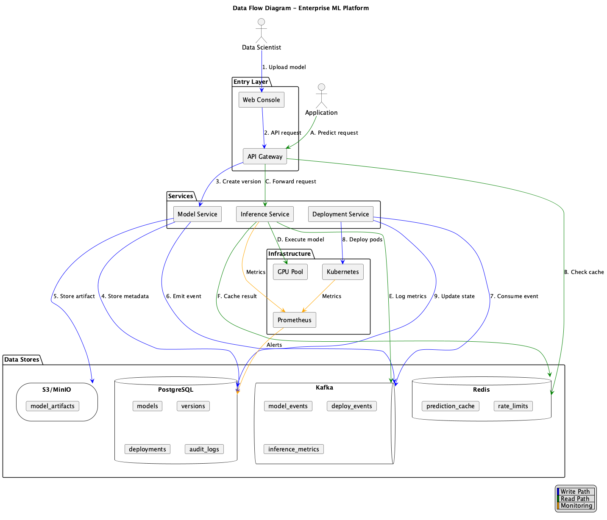

= Enterprise ML Platform: Модель данных
:toc: left
:toclevels: 3
:icons: font

== 1. Обзор архитектуры данных

=== 1.1 Стратегия хранения

[cols="2,2,2,3"]
|===
| Тип данных | Хранилище | Технология | Обоснование

| Метаданные моделей
| Реляционное
| PostgreSQL
| ACID-транзакции, сложные запросы, ссылочная целостность

| Артефакты моделей
| Объектное хранилище
| S3 / MinIO
| Большие бинарные файлы, версионирование, высокая надёжность

| Кэш предсказаний
| Key-Value
| Redis
| Низкая латентность, поддержка TTL, скорость in-memory

| События / Аудит
| Log / Stream
| Kafka → PostgreSQL
| Event sourcing, возможность replay, развязка

| Метрики
| Time-Series
| Prometheus / VictoriaMetrics
| Оптимизация для time-series запросов, агрегации
|===

== 2. Определения сущностей

=== 2.1 Основные сущности

==== Model

[source,sql]
----
CREATE TABLE models (
    id              UUID PRIMARY KEY DEFAULT gen_random_uuid(),
    name            VARCHAR(255) NOT NULL,
    description     TEXT,
    owner_id        UUID NOT NULL REFERENCES users(id),
    created_at      TIMESTAMP WITH TIME ZONE DEFAULT NOW(),
    updated_at      TIMESTAMP WITH TIME ZONE DEFAULT NOW(),

    CONSTRAINT unique_model_name UNIQUE (name)
);
----

==== ModelVersion

[source,sql]
----
CREATE TABLE model_versions (
    id              UUID PRIMARY KEY DEFAULT gen_random_uuid(),
    model_id        UUID NOT NULL REFERENCES models(id),
    version         VARCHAR(50) NOT NULL,  -- semver: 1.0.0
    state           VARCHAR(20) NOT NULL DEFAULT 'draft',
    artifact_uri    VARCHAR(500) NOT NULL,  -- s3://bucket/path
    artifact_hash   VARCHAR(64) NOT NULL,   -- SHA-256
    framework       VARCHAR(50) NOT NULL,   -- pytorch, onnx, tensorflow
    input_schema    JSONB,
    output_schema   JSONB,
    metadata        JSONB,  -- произвольные key-value
    created_at      TIMESTAMP WITH TIME ZONE DEFAULT NOW(),
    created_by      UUID NOT NULL REFERENCES users(id),

    CONSTRAINT unique_model_version UNIQUE (model_id, version),
    CONSTRAINT valid_state CHECK (state IN (
        'draft', 'validating', 'staging', 'production', 'deprecated', 'failed'
    ))
);

CREATE INDEX idx_model_versions_state ON model_versions(state);
CREATE INDEX idx_model_versions_model ON model_versions(model_id);
----

==== Deployment

[source,sql]
----
CREATE TABLE deployments (
    id              UUID PRIMARY KEY DEFAULT gen_random_uuid(),
    model_version_id UUID NOT NULL REFERENCES model_versions(id),
    status          VARCHAR(20) NOT NULL DEFAULT 'pending',
    endpoint_url    VARCHAR(500),
    replicas        INTEGER DEFAULT 1,
    min_replicas    INTEGER DEFAULT 1,
    max_replicas    INTEGER DEFAULT 10,
    traffic_percent INTEGER DEFAULT 0,  -- для canary
    config          JSONB,  -- лимиты ресурсов, env vars
    created_at      TIMESTAMP WITH TIME ZONE DEFAULT NOW(),
    updated_at      TIMESTAMP WITH TIME ZONE DEFAULT NOW(),
    created_by      UUID NOT NULL REFERENCES users(id),

    CONSTRAINT valid_status CHECK (status IN (
        'pending', 'deploying', 'running', 'failed', 'terminated'
    ))
);

CREATE INDEX idx_deployments_status ON deployments(status);
CREATE INDEX idx_deployments_version ON deployments(model_version_id);
----

==== User

[source,sql]
----
CREATE TABLE users (
    id              UUID PRIMARY KEY DEFAULT gen_random_uuid(),
    external_id     VARCHAR(255) NOT NULL,  -- из SSO
    email           VARCHAR(255) NOT NULL,
    name            VARCHAR(255),
    role            VARCHAR(50) NOT NULL DEFAULT 'viewer',
    created_at      TIMESTAMP WITH TIME ZONE DEFAULT NOW(),
    last_login_at   TIMESTAMP WITH TIME ZONE,

    CONSTRAINT unique_external_id UNIQUE (external_id),
    CONSTRAINT valid_role CHECK (role IN ('viewer', 'developer', 'admin'))
);
----

==== AuditLog

[source,sql]
----
CREATE TABLE audit_logs (
    id              UUID PRIMARY KEY DEFAULT gen_random_uuid(),
    timestamp       TIMESTAMP WITH TIME ZONE DEFAULT NOW(),
    user_id         UUID REFERENCES users(id),
    action          VARCHAR(100) NOT NULL,
    resource_type   VARCHAR(50) NOT NULL,
    resource_id     UUID NOT NULL,
    old_state       JSONB,
    new_state       JSONB,
    metadata        JSONB,

    -- Партиционирование по месяцам для эффективного retention
    PRIMARY KEY (id, timestamp)
) PARTITION BY RANGE (timestamp);

CREATE INDEX idx_audit_logs_resource ON audit_logs(resource_type, resource_id);
CREATE INDEX idx_audit_logs_user ON audit_logs(user_id);
----

=== 2.2 Вспомогательные сущности

==== APIKey

[source,sql]
----
CREATE TABLE api_keys (
    id              UUID PRIMARY KEY DEFAULT gen_random_uuid(),
    user_id         UUID NOT NULL REFERENCES users(id),
    key_hash        VARCHAR(64) NOT NULL,  -- SHA-256 от ключа
    name            VARCHAR(100) NOT NULL,
    scopes          TEXT[] NOT NULL,  -- ['inference:read', 'models:write']
    expires_at      TIMESTAMP WITH TIME ZONE,
    last_used_at    TIMESTAMP WITH TIME ZONE,
    created_at      TIMESTAMP WITH TIME ZONE DEFAULT NOW(),
    revoked_at      TIMESTAMP WITH TIME ZONE,

    CONSTRAINT unique_key_hash UNIQUE (key_hash)
);

CREATE INDEX idx_api_keys_user ON api_keys(user_id);
----

==== InferenceLog

[source,sql]
----
CREATE TABLE inference_logs (
    id              UUID PRIMARY KEY DEFAULT gen_random_uuid(),
    timestamp       TIMESTAMP WITH TIME ZONE DEFAULT NOW(),
    model_id        UUID NOT NULL,
    model_version   VARCHAR(50) NOT NULL,
    deployment_id   UUID NOT NULL,
    request_id      VARCHAR(100) NOT NULL,
    latency_ms      INTEGER NOT NULL,
    status_code     INTEGER NOT NULL,
    input_hash      VARCHAR(64),  -- для детекции дрифта
    cached          BOOLEAN DEFAULT FALSE,
    user_id         UUID,
    metadata        JSONB,

    PRIMARY KEY (id, timestamp)
) PARTITION BY RANGE (timestamp);

CREATE INDEX idx_inference_logs_model ON inference_logs(model_id, timestamp);
CREATE INDEX idx_inference_logs_deployment ON inference_logs(deployment_id, timestamp);
----

== 3. Связи между сущностями

=== 3.1 Сводка связей

[cols="2,1,2,2"]
|===
| Сущность 1 | Связь | Сущность 2 | Описание

| Model
| 1:N
| ModelVersion
| Модель имеет несколько версий

| ModelVersion
| 1:N
| Deployment
| Версия может иметь несколько развёртываний (canary)

| User
| 1:N
| Model
| Пользователь владеет моделями

| User
| 1:N
| APIKey
| Пользователь имеет API-ключи

| User
| 1:N
| AuditLog
| Действия пользователя логируются

| Deployment
| 1:N
| InferenceLog
| Развёртывание обслуживает запросы
|===

== 4. Требования консистентности

=== 4.1 Уровни консистентности по компонентам

[cols="2,2,3"]
|===
| Компонент | Консистентность | Обоснование

| Model Registry (PostgreSQL)
| Строгая
| Изменения состояния модели должны быть немедленно видны; ACID требуется для переходов жизненного цикла

| Кэш предсказаний (Redis)
| Eventual
| Устаревшие предсказания допустимы при коротком TTL; производительность важнее консистентности

| Аудит-лог
| Eventual
| Асинхронная запись через Kafka допустима; логи могут иметь небольшую задержку

| Метрики (Prometheus)
| Eventual
| Time-series данные по своей природе eventual; задержка ~10s допустима

| Состояние развёртывания
| Строгая
| Состояние K8s должно соответствовать реестру; транзакции для изменений состояния
|===

=== 4.2 Границы транзакций

==== Переход состояния модели

[source,sql]
----
BEGIN;
    -- Блокировка строки версии модели
    SELECT * FROM model_versions WHERE id = $1 FOR UPDATE;

    -- Валидация перехода
    -- например, можно перейти только из 'staging' в 'production'

    -- Обновление состояния
    UPDATE model_versions SET state = 'production', updated_at = NOW()
    WHERE id = $1;

    -- Создание записи аудит-лога
    INSERT INTO audit_logs (action, resource_type, resource_id, old_state, new_state)
    VALUES ('state_change', 'model_version', $1, $old_state, $new_state);
COMMIT;
----

==== Создание развёртывания

[source,sql]
----
BEGIN;
    -- Проверка существования версии модели и валидного состояния
    SELECT * FROM model_versions WHERE id = $1 AND state = 'staging';

    -- Создание развёртывания
    INSERT INTO deployments (model_version_id, status, config)
    VALUES ($1, 'pending', $config);

    -- Обновление состояния версии модели
    UPDATE model_versions SET state = 'validating' WHERE id = $1;
COMMIT;
-- Затем: асинхронное развёртывание K8s через событие
----

== 5. Политики хранения данных

[cols="2,2,2,2"]
|===
| Тип данных | Горячее хранение | Холодное хранение | Архив

| Артефакты моделей
| Бессрочно (пока активна)
| 90 дней после deprecation
| 1 год (S3 Glacier)

| Логи инференса
| 7 дней
| 30 дней (агрегированные)
| 1 год (комплаенс)

| Аудит-логи
| 30 дней
| 1 год
| 7 лет (комплаенс)

| Метрики
| 15 дней (сырые)
| 1 год (downsampled)
| Н/Д
|===

== 6. Диаграмма потоков данных

_Исходник: link:diagrams/sources/data-flow.puml[data-flow.puml]_

=== 6.1 Пути записи

[cols="2,4"]
|===
| Операция | Путь

| Загрузка модели
| Клиент → API Gateway → Model Service → PostgreSQL + S3

| Создание развёртывания
| Model Service → PostgreSQL → Kafka → Deployment Service → K8s

| Логирование инференса
| Inference Service → Kafka → Log Processor → PostgreSQL (партиционированный)
|===

=== 6.2 Пути чтения

[cols="2,4"]
|===
| Операция | Путь

| Получение метаданных модели
| Клиент → API Gateway → Model Service → PostgreSQL

| Выполнение инференса
| Клиент → API Gateway → Redis (кэш) → Inference Service → GPU

| Просмотр метрик
| Клиент → Grafana → Prometheus / VictoriaMetrics
|===

== 7. Оценки размеров

=== 7.1 Требования к хранению

[cols="2,2,2"]
|===
| Компонент | Оценочный размер | Расчёт

| Артефакты моделей (S3)
| 1 TB
| 100 моделей × 10GB в среднем

| Метаданные PostgreSQL
| 10 GB
| Модели + версии + развёртывания + аудит

| Кэш Redis
| 8 GB
| 1M кэшированных предсказаний × 8KB в среднем

| Метрики Prometheus
| 50 GB / месяц
| 100 моделей × 10 метрик × scrape 15s
|===

=== 7.2 Оценки пропускной способности

[cols="2,2,2"]
|===
| Операция | Частота | Расчёт

| Запросы инференса
| 10 000 RPS
| Целевая пиковая пропускная способность платформы

| Чтение реестра моделей
| 100 RPS
| Загрузка моделей, запросы UI

| Запись в реестр моделей
| 10 RPS
| Развёртывания, изменения состояний

| Запись аудит-логов
| 50 RPS
| Все изменения состояний + действия пользователей
|===